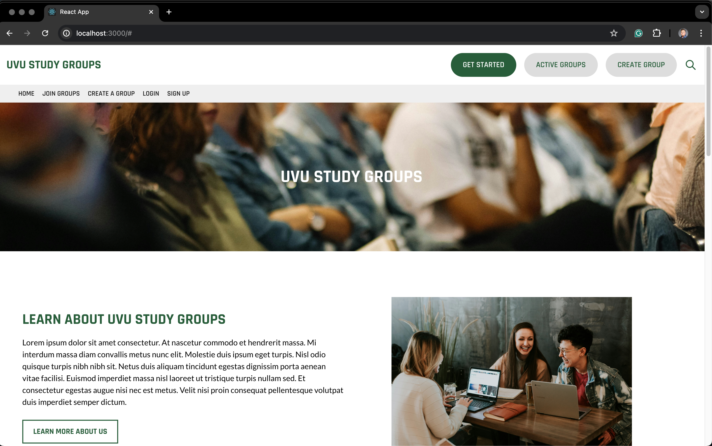
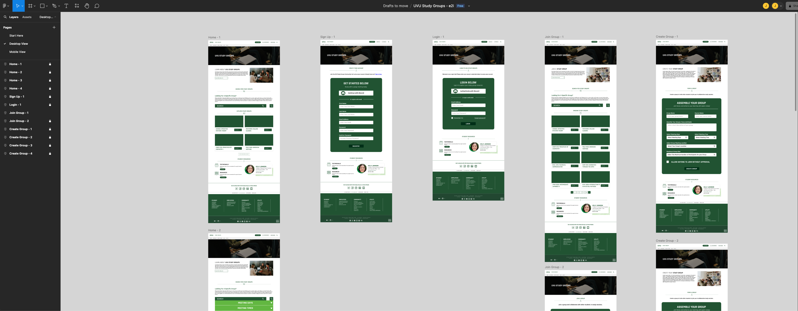

<a name="readme-top"></a>

<!-- PROJECT SHIELDS -->
<!--
*** Using markdown "reference style" links for readability.
*** Reference links are enclosed in brackets [ ] instead of parentheses ( ).
*** See the bottom of this document for the declaration of the reference variables
*** for contributors-url, forks-url, etc.
*** https://www.markdownguide.org/basic-syntax/#reference-style-links
-->
[![Contributors][contributors-shield]][contributors-url]
[![Forks][forks-shield]][forks-url]
[![Stargazers][stars-shield]][stars-url]
[![Issues][issues-shield]][issues-url]
[![MIT License][license-shield]][license-url]
[![LinkedIn][linkedin-shield]][linkedin-url]

<!-- PROJECT LOGO -->
<br />
<div align="center">
  <a href="https://github.com/jjacobsonn/uvu-studygroups-frontend">
    
  </a>

  <h3 align="center">UVU Study Groups</h3>

  <p align="center">
    An application to help students at UVU find and create study groups.
    <br />
    <a href="https://github.com/your_username/repo_name"><strong>Explore the docs »</strong></a>
    <br />
    <br />
    <a href="https://github.com/your_username/repo_name">View Demo</a>
    ·
    <a href="https://github.com/your_username/repo_name/issues/new?labels=bug&template=bug-report---.md">Report Bug</a>
    ·
    <a href="https://github.com/your_username/repo_name/issues/new?labels=enhancement&template=feature-request---.md">Request Feature</a>
  </p>
</div>

<!-- TABLE OF CONTENTS -->
<details>
  <summary>Table of Contents</summary>
  <ol>
    <li>
      <a href="#about-the-project">About The Project</a>
      <ul>
        <li><a href="#built-with">Built With</a></li>
      </ul>
    </li>
    <li>
      <a href="#getting-started">Getting Started</a>
      <ul>
        <li><a href="#prerequisites">Prerequisites</a></li>
        <li><a href="#installation">Installation</a></li>
      </ul>
    </li>
    <li><a href="#usage">Usage</a></li>
    <li><a href="#roadmap">Roadmap</a></li>
    <li><a href="#contributing">Contributing</a></li>
    <li><a href="#license">License</a></li>
    <li><a href="#contact">Contact</a></li>
  </ol>
</details>

<!-- ABOUT THE PROJECT -->
## About The Project

[](https://example.com)

UVU Study Groups is a web application developed as part of Utah Valley University's (UVU) Excellence & Innovation Initiative (e2i) program. This platform is designed to facilitate the creation, discovery, and management of study groups for UVU students, leveraging modern web technologies and integration with popular communication platforms.

### Key Features

- **User Authentication**: Secure login and signup functionality, with Discord integration for seamless access
- **Study Group Management**: Tools for creating, searching, and joining public study groups
- **Discord Integration**: Automatic server creation and member management for each study group
- **Intuitive User Interface**: A clean, responsive design optimized for both desktop and mobile devices

### Benefits

- **Enhanced Collaboration**: Facilitates easier connection between students with shared academic interests
- **Time Efficiency**: Reduces the overhead of manually coordinating study sessions
- **Improved Learning Outcomes**: Encourages peer-to-peer learning and knowledge exchange
- **University Integration**: Designed specifically for UVU students, aligning with university programs and initiatives

### Built With

* [![React][React.js]][React-url]
* [![TailwindCSS][TailwindCSS.com]][TailwindCSS-url]
* [![Express][Express.js]][Express-url]
* [![JavaScript][JavaScript.com]][JavaScript-url]
* [![CSS][CSS.com]][CSS-url]
* [![MySQL][MySQL.com]][MySQL-url]

<p align="right">(<a href="#readme-top">back to top</a>)</p>

<!-- FIGMA DESIGN -->
## Figma Design Documentation
[](https://example.com)

The design for UVU Study Groups was created in Figma. It includes both desktop and mobile layouts for the following pages:
- Home
- Sign Up
- Login
- Join Study Group
- Create Study Group

You can view the detailed Figma design here:
[UVU Study Groups Figma Design](https://www.figma.com/design/ym37iW2znUsgLhKauQ1bqv/UVU-Study-Groups---e2i?m=auto&t=lq7FYnXMh2zOMXNN-6)

<p align="right">(<a href="#readme-top">back to top</a>)</p>


<!-- GETTING STARTED -->
## Getting Started

To get a local copy up and running follow these simple steps.

### Prerequisites

You need to have Node.js, npm, and TailwindCSS installed.

* npm
  ```sh
  npm install npm@latest -g

* TailwindCSS
  ```sh
  npm install -D tailwindcss

### Installation

1. Clone the repository:
    ```sh
      git clone https://github.com/jjacobsonn/uvu-studygroups-frontend.git
    ```
2. Install application dependencies:
    ```sh
      cd uvu-study-groups
      npm install
    ```
3. Run the development server:
    ```sh
      npm start
    ```

<p align="right">(<a href="#readme-top">back to top</a>)</p>


### Usage
* Navigate to `http://localhost:3000` to use the application locally.

<p align="right">(<a href="#readme-top">back to top</a>)</p>


### Roadmap
- [x] Create GitHub Repo for Onboarding Project Members
- Frontend Roadmap
  - [x] Created Figma Outlining Main Application Pages
  - [x] Created `Home Page` + Components
  - [ ] Create Main Footer
  - [ ] Create and implement `Sign Up` Page
  - [ ] Create and implement `Login` Page
  - [ ] Create and implement `Join Study Group` Page
  - [ ] Create and implement `Create Study Group` Page 
  - [ ] Implement Mobile App Version
-   Backend Roadmap
  - [ ] Add User Authentication
  - [ ] Integrate Discord OAuth2
  - [ ] Add Notification System
  - [ ] Implement Backend DB for Study Groups  

<p align="right">(<a href="#readme-top">back to top</a>)</p>

<!-- CONTRIBUTING -->
## Contributing

Contributions are what make the open source community such an amazing place to learn, inspire, and create. Any contributions you make are **greatly appreciated**.

If you have a suggestion that would make this better, please fork the repo and create a pull request. You can also simply open an issue with the tag "enhancement".
Don't forget to give the project a star! Thanks again!

1. Fork the Project
2. Create your Feature Branch (`git checkout -b feature/YourFeatureContribution`)
3. Commit your Changes (`git commit -m 'Add some YourFeatureContribution'`)
4. Push to the Branch (`git push origin feature/YourFeatureContribution`)
5. Open a Pull Request

<p align="right">(<a href="#readme-top">back to top</a>)</p>

<!-- LICENSE -->
## License
This project is licensed under a Custom Restrictive License. See the [LICENSE](LICENSE.txt) file for more details.

<p align="right">(<a href="#readme-top">back to top</a>)</p>

<!-- CONTACT -->
## Contact

GitHub Owner: **Jackson Jacobson**

Twitter - [@jackson_swe](https://x.com/jackson_swe)

Email - jacobsonjackson3@gmail.com

LinkedIn: [https://www.linkedin.com/in/jjacobsonn/](https://www.linkedin.com/in/jjacobsonn/)

<p align="right">(<a href="#readme-top">back to top</a>)</p>

<!-- https://www.markdownguide.org/basic-syntax/#reference-style-links -->
[contributors-shield]: https://img.shields.io/github/contributors/othneildrew/Best-README-Template.svg?style=for-the-badge
[contributors-url]: https://github.com/jjacobsonn/uvu-studygroups-frontend/graphs/contributors
[forks-shield]: https://img.shields.io/github/forks/othneildrew/Best-README-Template.svg?style=for-the-badge
[forks-url]: https://github.com/jjacobsonn/uvu-studygroups-frontend/forks
[stars-shield]: https://img.shields.io/github/stars/othneildrew/Best-README-Template.svg?style=for-the-badge
[stars-url]: https://github.com/jjacobsonn/uvu-studygroups-frontend/stargazers
[issues-shield]: https://img.shields.io/github/issues/othneildrew/Best-README-Template.svg?style=for-the-badge
[issues-url]: https://github.com/jjacobsonn/uvu-studygroups-frontend/issues
[license-shield]: https://img.shields.io/github/license/othneildrew/Best-README-Template.svg?style=for-the-badge
[license-url]: https://github.com/othneildrew/Best-README-Template/blob/master/LICENSE.txt
[linkedin-shield]: https://img.shields.io/badge/-LinkedIn-black.svg?style=for-the-badge&logo=linkedin&colorB=555
[linkedin-url]: https://www.linkedin.com/in/jjacobsonn/
[product-screenshot]: images/screenshot.png
[Next.js]: https://img.shields.io/badge/next.js-000000?style=for-the-badge&logo=nextdotjs&logoColor=white
[Next-url]: https://nextjs.org/
[React.js]: https://img.shields.io/badge/React-20232A?style=for-the-badge&logo=react&logoColor=61DAFB
[React-url]: https://reactjs.org/
[Vue.js]: https://img.shields.io/badge/Vue.js-35495E?style=for-the-badge&logo=vuedotjs&logoColor=4FC08D
[Vue-url]: https://vuejs.org/
[Angular.io]: https://img.shields.io/badge/Angular-DD0031?style=for-the-badge&logo=angular&logoColor=white
[Angular-url]: https://angular.io/
[Svelte.dev]: https://img.shields.io/badge/Svelte-4A4A55?style=for-the-badge&logo=svelte&logoColor=FF3E00
[Svelte-url]: https://svelte.dev/
[Laravel.com]: https://img.shields.io/badge/Laravel-FF2D20?style=for-the-badge&logo=laravel&logoColor=white
[Laravel-url]: https://laravel.com
[Bootstrap.com]: https://img.shields.io/badge/Bootstrap-563D7C?style=for-the-badge&logo=bootstrap&logoColor=white
[Bootstrap-url]: https://getbootstrap.com
[JQuery.com]: https://img.shields.io/badge/jQuery-0769AD?style=for-the-badge&logo=jquery&logoColor=white
[JQuery-url]: https://jquery.com
[TailwindCSS.com]: https://img.shields.io/badge/TailwindCSS-06B6D4?style=for-the-badge&logo=tailwindcss&logoColor=white
[TailwindCSS-url]: https://tailwindcss.com/
[Express.js]: https://img.shields.io/badge/Express-000000?style=for-the-badge&logo=express&logoColor=white
[Express-url]: https://expressjs.com/
[JavaScript.com]: https://img.shields.io/badge/JavaScript-F7DF1E?style=for-the-badge&logo=javascript&logoColor=black
[JavaScript-url]: https://developer.mozilla.org/en-US/docs/Web/JavaScript
[CSS.com]: https://img.shields.io/badge/CSS-1572B6?style=for-the-badge&logo=css3&logoColor=white
[CSS-url]: https://developer.mozilla.org/en-US/docs/Web/CSS
[MySQL.com]: https://img.shields.io/badge/MySQL-4479A1?style=for-the-badge&logo=mysql&logoColor=white
[MySQL-url]: https://www.mysql.com/